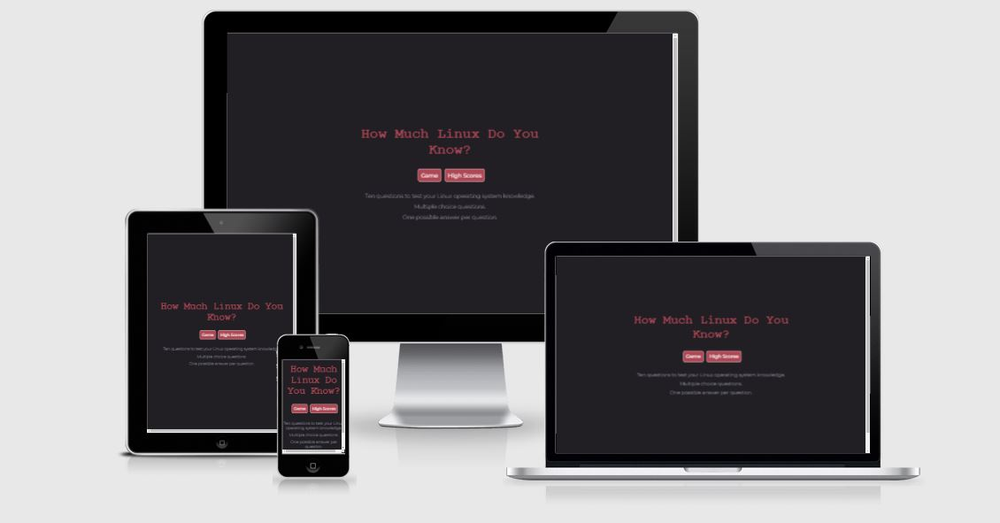
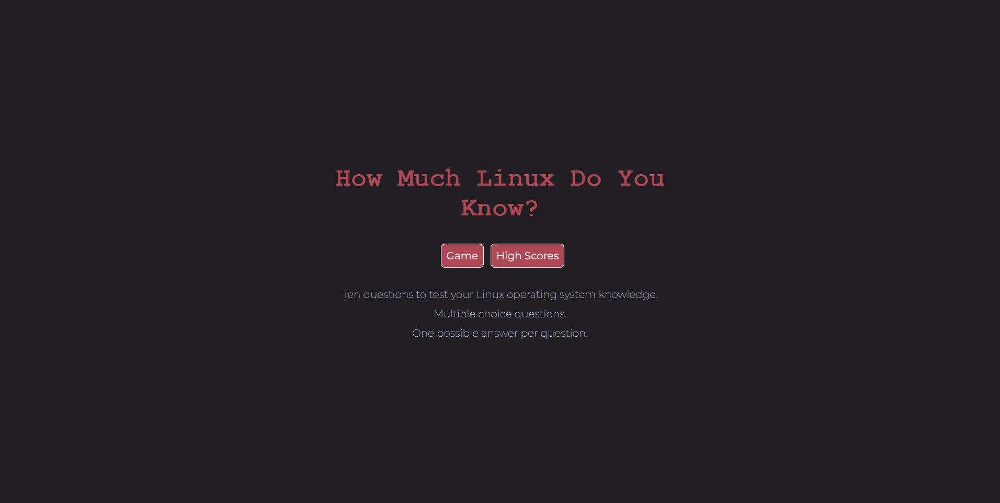
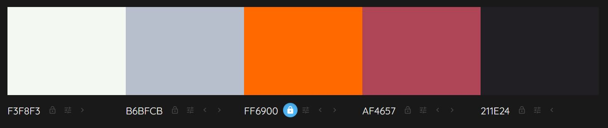
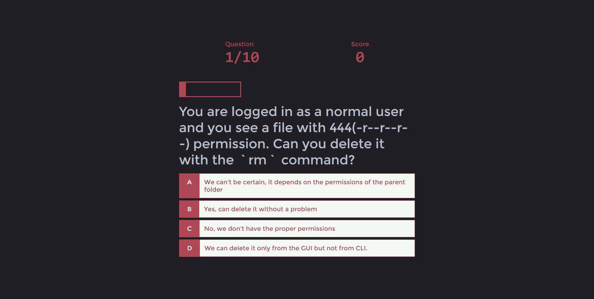
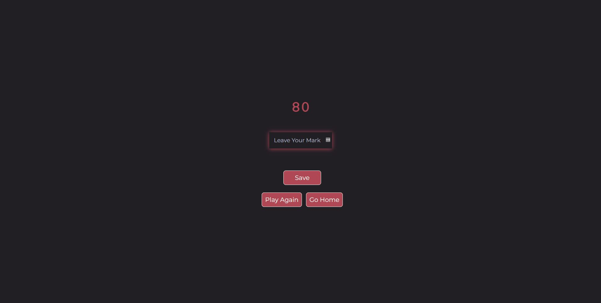
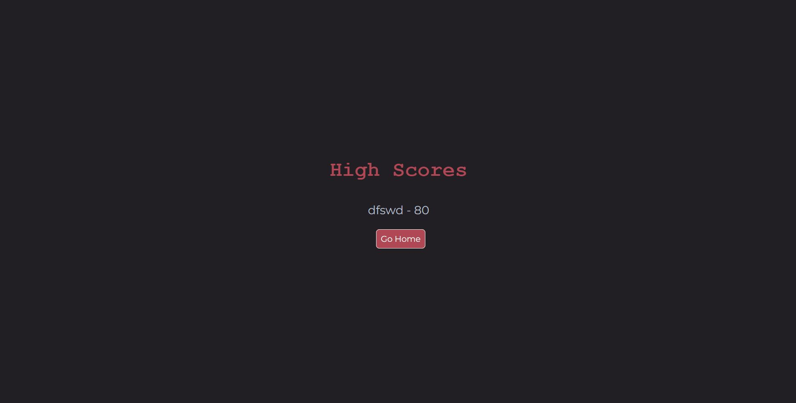
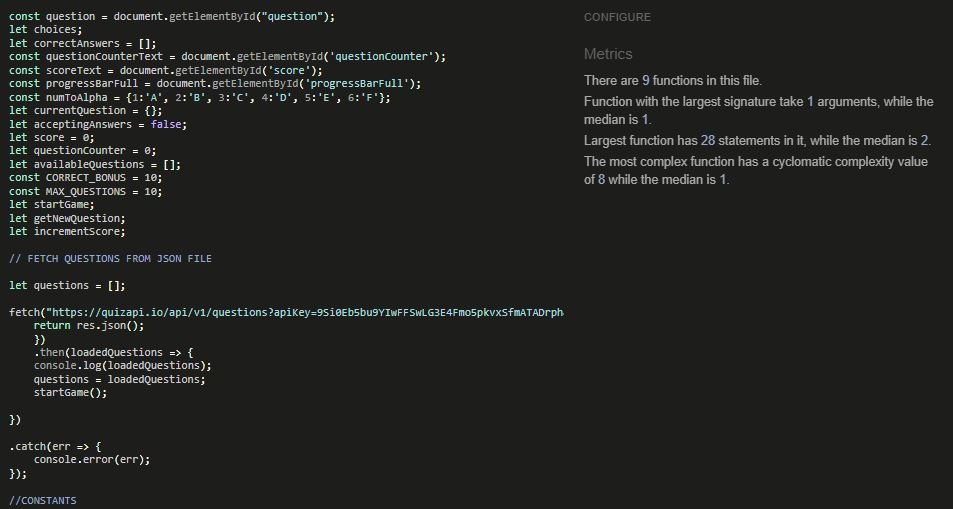
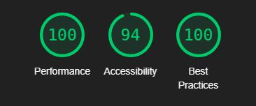
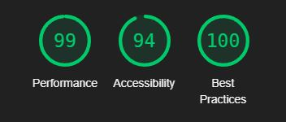

# How Much Linux Do You Know?

Multiple choice quiz game for Linux nerds.

Take a Look [Here](https://greengraf.github.io/how-much-do-you-know/)

 

## Portfolio Project 2

Linux is one of the most popular operating systems in the world and is especially popular amongst programmers and IT professionals. It's free, open-source, and highly customizable. Even though there is a bit of a learning curve with it, once you're familiar with its basic operations, you'll find it hard to go back to Windows or iOS.

### Purpose

This is an easy quiz designed to test the knowledge of newbie Linux users. Hopefully it will encourage users to explore Linux in more detail.

  

## User Experience Design

### Strategy 

#### User Stories

* As a website visitor I want to:
    * Intuatively know what the website is for.
    * Easily navigate to where I want.

* As a potential challenger I want to:
    * Understand the rules.
    * Understand what the quiz is about.

* As someone who is already interested in going here I want to:
    * Start the game quickly.
    * Check my high scores.

* As a website developer I want to:
    * Create a minimal quiz experience.
    * Offer the user intuitive feedback.
    * create a challengin and fun quiz for novice Linux enthusiasts.

### Scope

#### What features are planned
* Start page, with instructions.
* Randomly generated questions from a quiz API.
* Pregress bar.
* Question counter.
* Score counter.
* Option to input the user's name at the end of the game so they can store their score locally.
* A page for locally stored high scores.
* Users should get instant feedback on choices and results without any confusion.
#### Structure
* Three pages:
    * Title page
    * Game page
    * End page 
    * High scores page
#### Skeleton 
  

#### Surface
The idea behind the aesthetic of the game is to elicit a feeling of old-school technology by using carefully chosen font and a minimalist design.

##### Color Theme

* #FF6900 was going to be the primary color — it's the same color that Code Institute uses — but it didn't feel in harmony with the other colors and with what I wanted to achieve.
* The primary color, #AF4657, is a pastele red. Red signifies excitement or danger. I want to induce a certain amount of anxiety in the user.
* The secondary color, #B6BFCB, is a soft grey that's meant to compliment the red.
* The main font color is #F3F8F3. Is a warm white that's meant to improve the accessibility of some text and the buttons.
* #211E24 is the chosen color for the background of the website. I wanted a dark theme to induce a sense of mystery and as a nod to old-school terminals. I chose a warm black as opposed to pure black to ease the strain on the user's eyes. 

##### Typography

I decided to go with Courier New for the font. Another way to express the old-school vibe I was looking for. 

To pair with the slab serif typeface I chose a more moder font; Montserrat. It's easier to read so was more suited to the questions. 

## Existing Features

* Home Page

    * Because this was primarily a JavaScript project, I wanted to keep it as simple as possible. There's no navigation bar. There is the title, a button to start the game, a button to view the high scores, and a brief descreiption of the game.

 

* The Game
    * The game's questions and anwser choices are dynamically generated from an API. It has a progress bar to go with a fractional question counter, as well as a score counter.
 

 

* End Page
    * On the end page the user can see their score and choose to input thier name to add to a High Scores list on a local server. They can choose to play again right away or go back to the home screen. 
   

* High Scores Page

    * This page shows locally stored high scores. It will only show the top five scores.

   

 

* Footer 
    * The footer section just has the creator's name with links to Github and LinkedIn. It is on every page except for the game page becasue I want users to be fully immeresed while they're playing.

 

### Features Left to Implement 
* Changable difficulty setting.
* Button to exit out of the game while playing.
* Countdown timer.

## Technologies Used

* The project was written in HTML and CSS and JavaScript.
* The project used Code Institute's [Gitpod Template](https://github.com/Code-Institute-Org/gitpod-full-template) 
* Github was used for hosting, utilising git version control, and for hosting the site on GitHub pages.
* [Google Fonts](https://fonts.google.com/) for fonts.
* [Gitpod](https://gitpod.io/) was used to write and test the code. 
* [Font Awesome](https://fontawesome.com/) was used as a resource for free icons.
* [Colormind](http://colormind.io/) was used to generate a color theme.
* **Testing tools are credited and mentioned in the next section**

## Testing

The website was deployed and tested on the most common screen sizes, down to 320px. It was responsive on all screens.

The game was also thoroughly and while it functioned very well there was one concerning error. This was the fact that most of the answers were for choice A. If one didn't have any experience with Linux they could still score quite high (if not get perfect scores) if they just chose answer A every time. This was a bug in the API's source code and I noticed it too late to have a proper go at fixing it.

### Validator Testing

* HTML
    * No errors occured after auditing every page with the official [W3C Validator](https://validator.w3.org/nu/?doc=https%3A%2F%2Fgreengraf.github.io%2Fhow-much-do-you-know%2Findex.html)
* CSS
    * No errors occured after auditing every page with the official [(Jigsaw) Validator](https://jigsaw.w3.org/css-validator/validator?uri=https%3A%2F%2Fjigsaw.w3.org%2Fcss-validator%2Fvalidator%3Furi%3Dhttps%253A%252F%252Fgreengraf.github.io%252Fhow-much-do-you-know%252F%26profile%3Dcss3svg%26usermedium%3Dall%26warning%3D1%26vextwarning%3D%26lang%3Den&profile=css3svg&usermedium=all&warning=1&vextwarning=&lang=en)
* JS Hint
    * No errors were detected on any of the screens in JS Hint 
     
    

#### Lighthouse — Dev Tools

* I used Lighthouse to test my sites accessability and it received a very good score on desktop and mobile.

 

* Accessibility and performance on all screens and devices was very good.

 
 

## Deployment

* The site was deployed to GitHub pages. The steps to deploy are as follows:
    * In the GitHub repository, navigate to the Settings tab
    * From the source section drop-down menu, select the Master Branch
    * Once the master branch has been selected, the page will be automatically refreshed with a detailed ribbon display to indicate the successful deployment.

There is a link to the live site at the begining of this README.md but for convienience I'll paste the full link here: https://greengraf.github.io/how-much-do-you-know/index.html

## Clone and Fork

### Clone 

* In Github, click on the project that you wish to clone.
* Click the clipboard icon to copy the URL.
* The fork will now be in your repository.
* Open a new terminal.
* Change the current working directory to the location that you want the cloned directory.
* Type 'git clone' and paste the URL copied in step 2.
* Press 'Enter' to clone the project.

### Fork

* In Github, click on the project that you wish to fork.
* Click on the 'Fork' button at the top right of the page.
* The fork is now in your repository.

## Credits

I like to say a massive "Thank You" to my mentor, Ben Kavanagh. He's a fantastic motivator and extremely helpful. Also a big thanks to all the helpful people in the Slack community!

### Code

* HTML, CSS and JavaScript tips from [Mozilla](https://developer.mozilla.org) developer documentation.
* HTML, CSS and JavaScript [Stack Overflow](https://stackoverflow.com/).
* HTML and CSS tips from [W3Schools](https://www.w3schools.com/).

### Content

* The core JavaScript was adopted from James Quick's tutorial on Udemy [Quiz App Tutorial](https://www.udemy.com/course/build-a-quiz-app-with-html-css-and-javascript/).
* The API for the quiz was taken from [Quiz API](https://quizapi.io/)
* The icons used in the footer are from [Font Awesome](https://fontawesome.com/)

